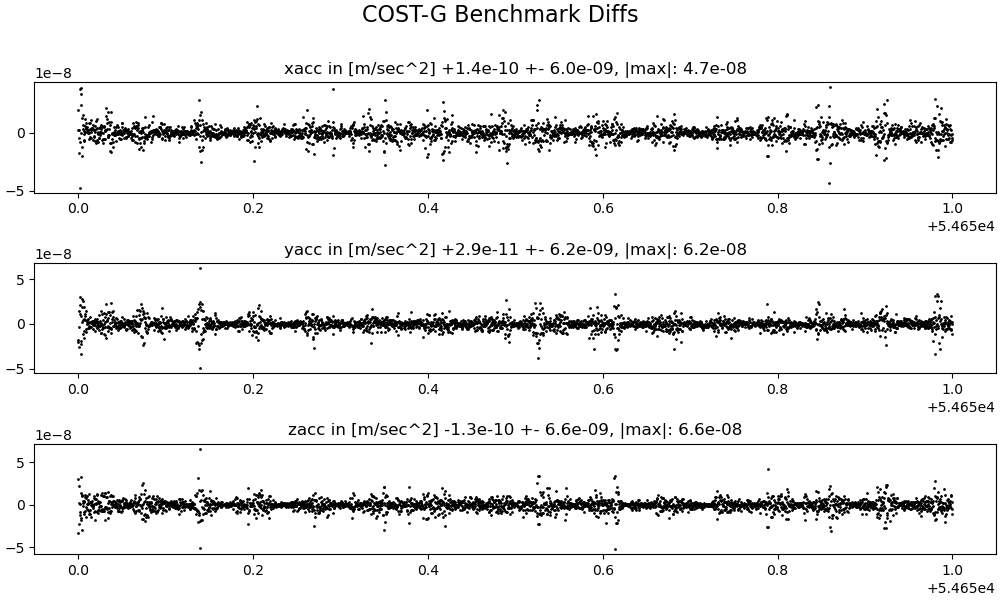

# Results against the [COST-G](https://cost-g.org/) Benchmark Test

For information on the benchmark test, see the paper 
[Benchmark data for verifying background model implementations in orbit and gravity field determination software](https://adgeo.copernicus.org/articles/55/1/2020/)

## 01 earth rotation

### 01earthRotation_interpolatedEOP
`costg/check-01eop.out data/EOP_14_C04_IAU2000A_one_file_1962-now.txt costG/01earthRotation_interpolatedEOP.txt | costg/plot_costg_01earthRotation_interpolatedEOP.py`

### 01earthRotation_rotaryMatrix
`costg/check-01rot.out data/EOP_14_C04_IAU2000A_one_file_1962-now.txt costG/01earthRotation_rotaryMatrix.txt | costg/plot_costg_01earthRotation_rotarymatrix.py`

### 02gravityfield_itrf

