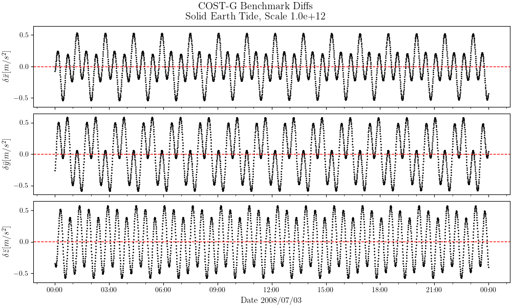
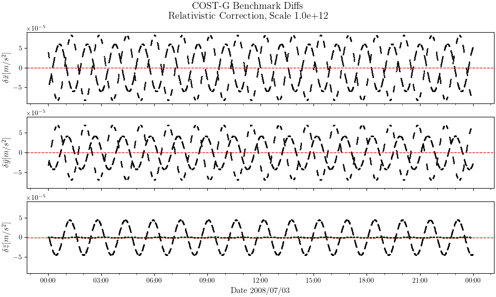

# Results against the [COST-G](https://cost-g.org/) Benchmark Test

For information on the benchmark test, see the paper 
[Benchmark data for verifying background model implementations in orbit and gravity field determination software](https://adgeo.copernicus.org/articles/55/1/2020/)

## 01 earth rotation

### 01earthRotation_interpolatedEOP
```
$>costg/check-01eop.out \
 costG/models/eopc04_14_IAU2000.62-now \
 costG/satellite/01earthRotation_interpolatedEOP.txt \
 | costg/plot_costg_01earthRotation_interpolatedEOP.py
```


### 01earthRotation_rotaryMatrix
```
  $>costg/check-01rot.out \
  costG/models/eopc04_14_IAU2000.62-now \
  costG/satellite/01earthRotation_rotaryMatrix.txt \
  | costg/plot_costg_01earthRotation_rotarymatrix.py
```


## Accelerations
|Component|Mean |Std. Deviation|Min |Max |Scale for [m/sec^2]|
|:--      | :-- | :--          |:-- |:-- |:-- |
|Gravity Field n=(2..180) |
|x|+7.253e-06|+7.373e-04|-4.385e-03|+2.966e-03|+1.000e+12|
|y|-1.631e-05|+7.162e-04|-4.226e-03|+3.882e-03|+1.000e+12|
|z|-1.274e-05|+1.026e-03|-4.323e-03|+3.861e-03|+1.000e+12|
|a|+1.272e-03|+7.011e-04|+2.786e-05|+4.395e-03|+1.000e+12|
|Third Body [SUN]|
|x|-6.388e-06|+3.295e-04|-4.736e-04|+4.747e-04|+1.000e+12|
|y|-8.257e-06|+4.732e-04|-6.801e-04|+6.821e-04|+1.000e+12|
|z|-4.593e-06|+2.530e-04|-3.602e-04|+3.624e-04|+1.000e+12|
|a|+5.849e-04|+2.332e-04|+1.703e-04|+8.769e-04|+1.000e+12|
|Third Body [MOON]|
|x|-3.079e-05|+1.686e-03|-2.489e-03|+2.389e-03|+1.000e+12|
|y|+1.075e-06|+2.208e-03|-3.182e-03|+3.238e-03|+1.000e+12|
|z|-2.783e-05|+9.411e-04|-1.838e-03|+1.860e-03|+1.000e+12|
|a|+2.916e-03|+3.150e-04|+2.278e-03|+3.508e-03|+1.000e+12|
|Solid Earth Tide |
|x|-3.168e-03|+2.707e-01|-5.404e-01|+5.310e-01|+1.000e+12|
|y|+3.972e-03|+3.420e-01|-5.842e-01|+5.842e-01|+1.000e+12|
|z|+6.960e-04|+3.515e-01|-5.758e-01|+5.713e-01|+1.000e+12|
|a|+5.536e-01|+8.465e-02|+3.798e-01|+6.922e-01|+1.000e+12|
|Solid Earth Pole Tide |
|x|+2.964e-02|+1.658e+00|-5.724e+00|+8.749e+01|+1.000e+12|
|y|-1.742e-02|+1.256e+00|-6.417e+01|+1.192e+01|+1.000e+12|
|z|+1.203e-02|+5.505e-01|-6.968e-01|+2.370e+01|+1.000e+12|
|a|+5.473e-01|+2.082e+00|+2.616e-02|+1.111e+02|+1.000e+12|
|Ocean Pole Tide n=(2..180) |
|x|+1.905e+00|+1.668e+02|-3.158e+02|+3.175e+02|+1.000e+12|
|y|-4.896e-01|+1.739e+02|-3.612e+02|+3.603e+02|+1.000e+12|
|z|-2.263e-01|+1.893e+02|-4.422e+02|+4.346e+02|+1.000e+12|
|a|+2.921e+02|+9.241e+01|+2.146e+01|+4.770e+02|+1.000e+12|
|Relativistic Correction |
|x|-1.003e-07|+4.905e-05|-8.281e-05|+8.272e-05|+1.000e+12|
|y|-3.150e-07|+3.851e-05|-6.972e-05|+7.010e-05|+1.000e+12|
|z|-4.085e-07|+2.490e-05|-4.480e-05|+4.440e-05|+1.000e+12|
|a|+6.335e-05|+2.224e-05|+1.537e-06|+1.084e-04|+1.000e+12|
|FES2014 Major Waves n=(2..180) |
|x|-1.034e+03|+4.769e+03|-1.742e+04|+1.451e+04|+1.000e+12|
|y|+7.850e+02|+4.794e+03|-1.805e+04|+1.614e+04|+1.000e+12|
|z|-2.076e+02|+4.515e+03|-1.912e+04|+1.865e+04|+1.000e+12|
|a|+7.058e+03|+4.244e+03|+2.337e+02|+2.210e+04|+1.000e+12|

### 02gravityfield_itrf

Note that $GM$ and $Re$ constants (for Earth) are extracted from the `EIGEN6-C4.gfc` 
data file (header). This test does not include transformation between ITRF/GCRF 
frames. All computations performed in ITRF.


### 03directTide[Sun|Moon]_icrf


Note that $GM$ for Sun and Moon are extracted from the benchmark documentation, i.e. 
`00README_simulation.txt`. Sun and Moon positions are extracted using 
[c-spice](https://naif.jpl.nasa.gov/naif/toolkit.html).
This test does not include transformation between ITRF/GCRF frames. All computations 
performed in GCRF.

### 04solidEarthTide_icrf.txt


Note that $GM$ for Sun and Moon are extracted from the benchmark documentation, i.e. 
`00README_simulation.txt`. Sun and Moon positions are extracted using 
[c-spice](https://naif.jpl.nasa.gov/naif/toolkit.html). This test also includes 
transformations between ITRF/GCRF frames.

Results are way worse if i use the provided quaternions for transforming 
between GCRF/ITRF (argument `01earthRotation_quaternion.txt`). Compile with 
`USE_OWN_ROTATION_COSTG` option to use own transformation.

### 05poleTide_icrf.txt

Test includes transformations between ITRF/GCRF frames.


### 06oceanPoleTide_icrf.txt

Test includes transformations between ITRF/GCRF frames.

### 07relativistic_icrf.txt

[c-spice](https://naif.jpl.nasa.gov/naif/toolkit.html) used to compute Sun position 
and approximate Earth/Sun velocity.

## Other Tests

### ITRF to ICRF transformation
Here, we get the positions (cartesian, ITRF) from the input file `00orbit_itrf.txt`, 
and transform each position vector to ICRF (cartesian). We compare the results 
obtained, with the file `00orbit_icrf.txt`.

```
  $>costg/check-itrf2icrf.out \
  costG/eopc04_14_IAU2000.62-now \
  costG/00orbit_itrf.txt costG/00orbit_icrf.txt \
  | costg/plot_costg_itrf2icrf.py
```

