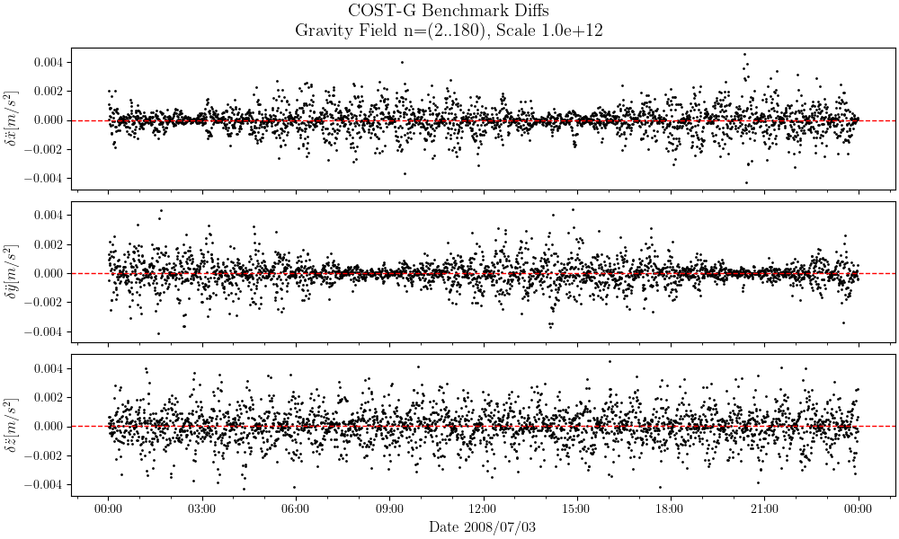
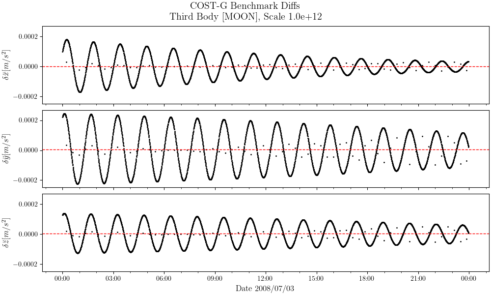
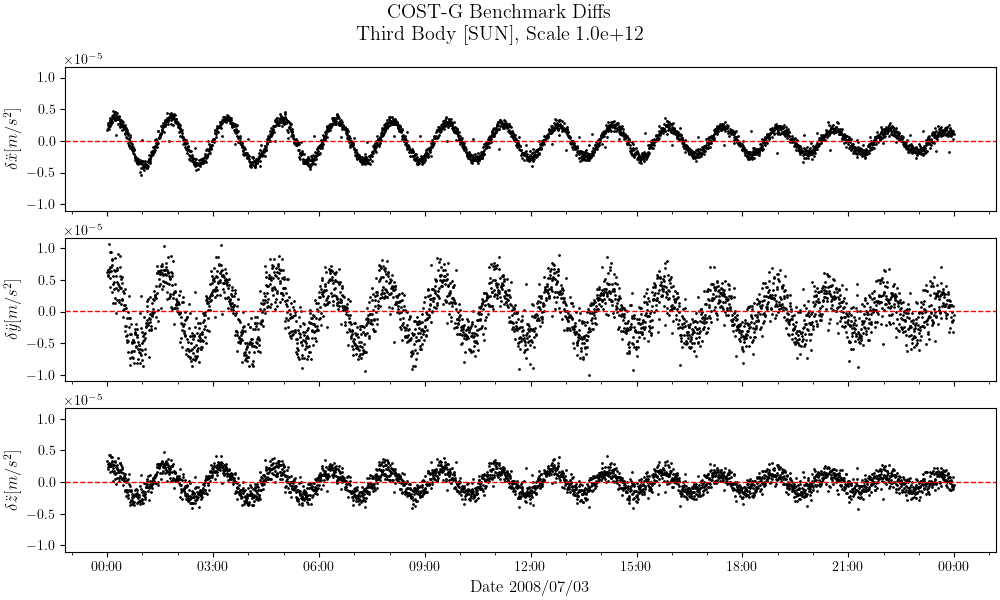

# Results against the [COST-G](https://cost-g.org/) Benchmark Test

For information on the benchmark test, see the paper 
[Benchmark data for verifying background model implementations in orbit and gravity field determination software](https://adgeo.copernicus.org/articles/55/1/2020/)

## 01 earth rotation

### 01earthRotation_interpolatedEOP
```
$>costg/check-01eop.out \
 costG/models/eopc04_14_IAU2000.62-now \
 costG/satellite/01earthRotation_interpolatedEOP.txt \
 | costg/plot_costg_01earthRotation_interpolatedEOP.py
```


### 01earthRotation_rotaryMatrix
```
  $>costg/check-01rot.out \
  costG/models/eopc04_14_IAU2000.62-now \
  costG/satellite/01earthRotation_rotaryMatrix.txt \
  | costg/plot_costg_01earthRotation_rotarymatrix.py
```


## Accelerations

### 02gravityfield_itrf

Note that $GM$ and $Re$ constants (for Earth) are extracted from the `EIGEN6-C4.gfc` 
data file (header). This test does not include transformation between ITRF/GCRF 
frames. All computations performed in ITRF.


### 03directTide[Sun|Moon]_icrf


Note that $GM$ for Sun and Moon are extracted from the benchmark documentation, i.e. 
`00README_simulation.txt`. Sun and Moon positions are extracted using 
[c-spice](https://naif.jpl.nasa.gov/naif/toolkit.html).
This test does not include transformation between ITRF/GCRF frames. All computations 
performed in GCRF.

### 04solidEarthTide_icrf.txt


Note that $GM$ for Sun and Moon are extracted from the benchmark documentation, i.e. 
`00README_simulation.txt`. Sun and Moon positions are extracted using 
[c-spice](https://naif.jpl.nasa.gov/naif/toolkit.html). This test also includes 
transformations between ITRF/GCRF frames.

Results are way worse if i use the provided quaternions for transforming 
between GCRF/ITRF (argument `01earthRotation_quaternion.txt`). Compile with 
`USE_OWN_ROTATION_COSTG` option to use own transformation.


### 05poleTide_icrf.txt

Test includes transformations between ITRF/GCRF frames.


### 06oceanPoleTide_icrf.txt

Test includes transformations between ITRF/GCRF frames.

### 07relativistic_icrf.txt

[c-spice](https://naif.jpl.nasa.gov/naif/toolkit.html) used to compute Sun position 
and approximate Earth/Sun velocity.

## Other Tests

### ITRF to ICRF transformation
Here, we get the positions (cartesian, ITRF) from the input file `00orbit_itrf.txt`, 
and transform each position vector to ICRF (cartesian). We compare the results 
obtained, with the file `00orbit_icrf.txt`.

```
  $>costg/check-itrf2icrf.out \
  costG/eopc04_14_IAU2000.62-now \
  costG/00orbit_itrf.txt costG/00orbit_icrf.txt \
  | costg/plot_costg_itrf2icrf.py
```

